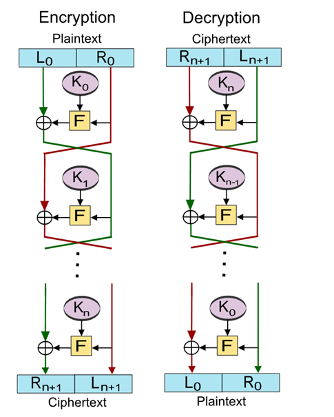
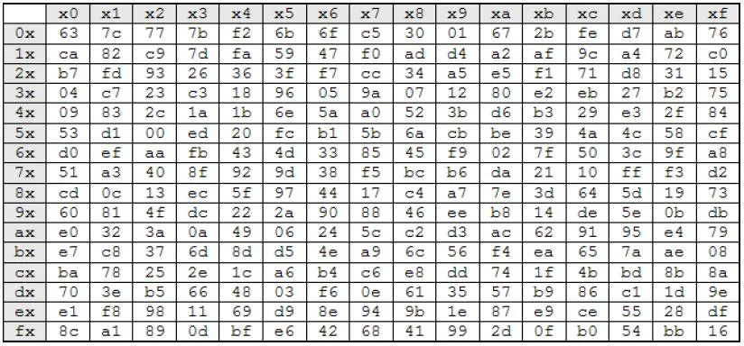
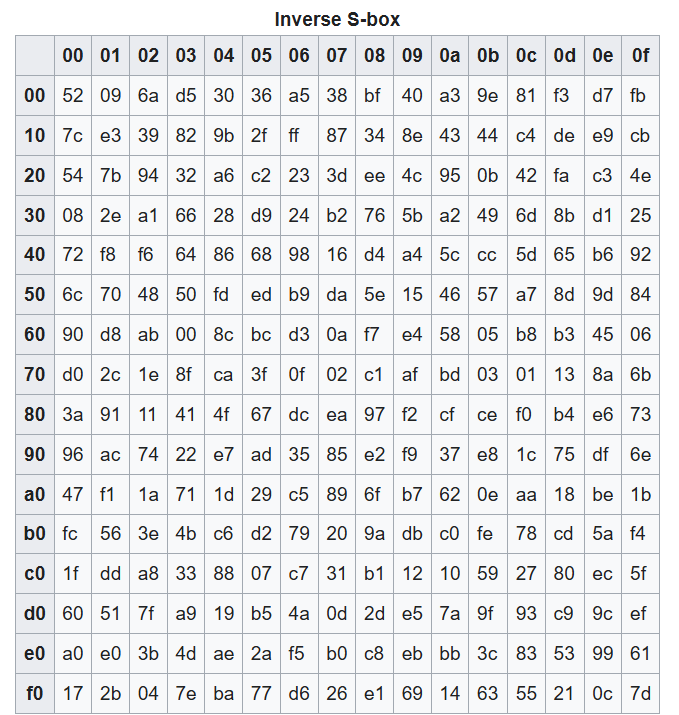

## Exercise 1  
### Encryption :  

$R_2  = f_2 (f_1 (r_0 )⊕ l_0 )⊕ r_0$    
$= f_2 (f_1 (m_1 )⊕ m_0 )⊕ m_1$

$L_2  =f_1 (r_0 )⊕ l_0$    
$= f_1 (m_1 )⊕ m_0 $

### Decryption  

$L_2  =f_1 (r_0 )⊕ l_0$

We set $r_0=L_2$,   $l_0=R_2$  and switch $f_1,f_2$  

$L_2  =f_2 (L_2 )⊕ R_2$    
$=f_2 (f_1 (m_1 )⊕ m_0  )⊕ f_2 (f_1 (m_1 )⊕ m_0 )⊕ m_1$   
$=m_1$  

$R_2  = f_2 (f_1 (r_0 )⊕ l_0 )⊕ r_0$  

We set $r_0=L_2,l_0=R_2$ and switch $f_1,f_2$  

$R_2  = f_1 (f_2 (L_2 )⊕ R_2 )⊕ L_2$   
$= f_1 (f_2 (f_1 (r_0 )⊕ l_0 )⊕ f_2 (f_1 (r_0 )⊕ l_0 )⊕ r_0  )⊕ f_1 (r_0 )⊕ l_0$    
$=f_1 (r_0 )⊕ f_1 (r_0 )⊕ l_0$   
$=l_0$  

## Exercise 2  
Sbox 

sbox^-1 

**Messages**   
$m_0 = l_0 = "I" = (73)_{10} = (01001001)_2$  
$m_1 = r_0 = "N" = (78)_{10} = (01001110)_2$  
$k = (11010110)_2 = (214)_{10}$  

**Encrypt** 
$R_2= f_2 (f_1 (m_1 )⊕ m_0 )⊕ m_1$  
$= f_2 (f_1 (78 )⊕ 73 )⊕ 78$  
$= f_2 (S(36) \oplus 73) \oplus 78$  
$= f_2 (54 \oplus 73)\oplus 78$  
$= f_2 (127)\oplus 78$  
$= S^{-1}(85) \oplus 78$  
$= 237 \oplus 78 = 163 $  

$L_2= f_1 (m_1 )⊕ m_0 $  
$= f_1(78) \oplus 73$  
$= S(36) \oplus 73$ 
$= 54 \oplus 73$
$= 127$ 

**Decrypt**     
$m_1=L_2  =f_2 (L_2 )⊕ R_2$  
$=f_2 (127 )⊕ 163 $  
$=S^{-1}(85) \oplus 163$   
$= 237 \oplus 163$    
$=78$   

$m_0=R_2  = f_1 (f_2 (L_2 )⊕ R_2 )⊕ L_2$    
$=  f_1 (f_2 (127 )⊕ 163 )⊕ 127$  
$= f_1 (S^{-1}(85 )⊕ 163 )⊕ 127$  
$= f_1 (237⊕ 163 )⊕ 127$  
$= f_1 (78 )⊕ 127$  
$= S(36 )⊕ 127$  
$= 54⊕ 127$  
$=73$  

## b,c, d
in ipynb 

## e
Yes, its possible. 
We query two cyphertexts with same right halve but different left halve.   
$P_A = (l_a, r), P_B = (l_b, r)$  

$C_{A} = (f_1 (r )⊕ l_a, \;\;f_2 (f_1 (r )⊕ l_a )⊕ r)$  
$C_{B} = (f_1 (r )⊕ l_b, \;\;f_2 (f_1 (r )⊕ l_b )⊕ r)$

From this we can calculate $f_1(r) = C_{B,l} \oplus l_b$ (or the same for a)  
Now we query   
$C_{A/B} = Oracle(P_{A'}, P_{B'})$  
with   
$P_{A'} = (l_a', r)$  
$P_{B'} = (l_b', r)$  
we then calculate  
$C_{A/B, l}\oplus f_1(r)$  
and either receive $l_b'$ or $l_a'$ which tells us to which plaintext it coresponds. 

## Exercise 2:  Modes of operation 

CBC -> normal, erstes mal mit iv danach wird output von encrypt als iv benutzt

| Property | Electronic Code Book (ECB) | Cipher Block Chaining (CBC)| Cipher Feedback (CFB)| Output Feedback (OFB)| Counter Mode (CTR)|
|:--:|:--:|:--:|:--:|:--:|:--:|
| a) | block | Full | Full | partial | partial| 
|b) | No | No | Yes | Yes | Yes| 
| c)| resume | Yes (after one block) | Yes (after one block) | for known length | for known length| 
|d) |No propagation | 2 block | 2 block | only block (the bit) | only block (the bit itself)
|e) | Yes | No | No | No | Yes | 
|f) | Yes | Decryption yes | Dec yes | No | Yes | 
| g)| No | No |No | Yes | Yes| 
| h) | no iv | public random | public random |not fixed: pred/sys| not fixed: pred/sys | 

### c
ECB -> can resume everything
CBC -> yes
CFB -> yes
Ofb -> only if known 
CTR -> only if known 

### h
CBC, CFB -> has to be different everytime but secret is not so important 
-> attacker knows iv+1 regardless; same key + message -> same cyphertext 