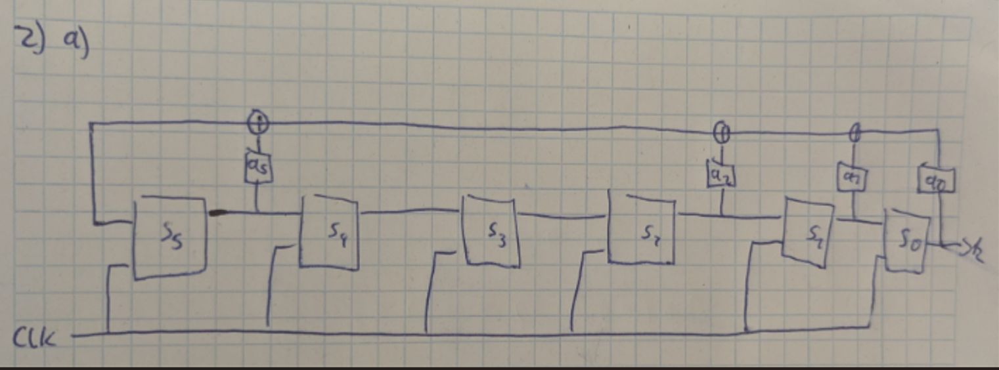

## 2
### a

### b
$$
\begin{align*}
k_6 = s_5 \oplus s_2 \oplus s_1 \oplus s_0
\end{align*}
$$

$$
\begin{align*}
k_7 &= k_6 \oplus s_3 \oplus s_2 \oplus s_1 \\
    &= s_5 \oplus s_0 \oplus s_3 
\end{align*}
$$

$$
\begin{align*}
k_8 &= k_7 \oplus s_4 \oplus s_3 \oplus s_2 \\
    &= s_5 \oplus s_0   \oplus s_4  \oplus s_2
\end{align*}
$$

$$
\begin{align*}
k_9 &= k_8 \oplus s_5 \oplus s_4 \oplus s_3 \\
    &=  s_0   \oplus s_2 \oplus s_3 
\end{align*}
$$  

$$
\begin{align*}
k_{10} &= k_9 \oplus k_6 \oplus s_5 \oplus s_4 \\
        &=   s_3  \oplus s_1   \oplus s_4 
\end{align*}
$$ 

$$
\begin{align*}
k_{11} &= k_{10} \oplus k_7 \oplus k_6 \oplus s_5 \\
       &=   s_4  \oplus s_5  \oplus s_2   
\end{align*}
$$ 

$$
\begin{aligned}
&
\left(
\begin{array}{cccccc|c}
1 & 1 & 1 & 0 & 0 & 1 & 0 \\
1 & 0 & 0 & 1 & 0 & 1 & 0\\
1 & 0 & 1 & 0 & 1 & 1 & 0\\
1 & 0 & 1 & 1 & 0 & 0 & 0\\
0 & 1 & 0 & 1 & 1 & 0 & 0\\
0 & 0 & 1 & 0 & 1 & 1 & 1\\
\end{array}
\right)\\
\xrightarrow{II:I\oplus II; III: III\oplus I; IV: IV\oplus I}
& \left(
\begin{array}{cccccc|c}
1 & 1 & 1 & 0 & 0 & 1 & 0 \\
0 & 1 & 1 & 1 & 0 & 0 & 0\\
0 & 1 & 0 & 0 & 1 & 0 & 0\\
0 & 1 & 0 & 1 & 0 & 1 & 0\\
0 & 1 & 0 & 1 & 1 & 0 & 0\\
0 & 0 & 1 & 0 & 1 & 1 & 1\\
\end{array}
\right)\\
\xrightarrow{III: III \oplus II; IV: IV\oplus II}
& \left(
\begin{array}{cccccc|c}
1 & 1 & 1 & 0 & 0 & 1 & 0 \\
0 & 1 & 1 & 1 & 0 & 0 & 0\\
0 & 0 & 1 & 1 & 1 & 0 & 0\\
0 & 0 & 1 & 0 & 0 & 1 & 0\\
0 & 0 & 1 & 0 & 1 & 0 & 0\\
0 & 0 & 1 & 0 & 1 & 1 & 1\\
\end{array}
\right) \\
\xrightarrow{IV: IV\oplus III; V: V\oplus III}
& \left(
\begin{array}{cccccc|c}
1 & 1 & 1 & 0 & 0 & 1 & 0 \\
0 & 1 & 1 & 1 & 0 & 0 & 0\\
0 & 0 & 1 & 1 & 1 & 0 & 0\\
0 & 0 & 0 & 1 & 1 & 1 & 0\\
0 & 0 & 0 & 1 & 0 & 0 & 0\\
0 & 0 & 0 & 1 & 0 & 1 & 1\\
\end{array}
\right) \\
\xrightarrow{V: V\oplus IV}
&\left(
\begin{array}{cccccc|c}
1 & 1 & 1 & 0 & 0 & 1 & 0 \\
0 & 1 & 1 & 1 & 0 & 0 & 0\\
0 & 0 & 1 & 1 & 1 & 0 & 0\\
0 & 0 & 0 & 1 & 1 & 1 & 0\\
0 & 0 & 0 & 0 & 1 & 1 & 0\\
0 & 0 & 0 & 0 & 1 & 0 & 1\\
\end{array}
\right)\\
\xrightarrow{}
&\left(
\begin{array}{cccccc|c}
1 & 1 & 1 & 0 & 0 & 1 & 0 \\
0 & 1 & 1 & 1 & 0 & 0 & 0\\
0 & 0 & 1 & 1 & 1 & 0 & 0\\
0 & 0 & 0 & 1 & 1 & 1 & 0\\
0 & 0 & 0 & 0 & 1 & 1 & 0\\
0 & 0 & 0 & 0 & 0 & 1 & 1\\
\end{array}
\right)
\end{aligned}
$$
**Resolve** 
$$
\begin{aligned}
&\left(
\begin{array}{cccccc|c}
1 & 1 & 1 & 0 & 0 & 1 & 0 \\
0 & 1 & 1 & 1 & 0 & 0 & 0\\
0 & 0 & 1 & 1 & 1 & 0 & 0\\
0 & 0 & 0 & 1 & 1 & 1 & 0\\
0 & 0 & 0 & 0 & 1 & 1 & 0\\
0 & 0 & 0 & 0 & 0 & 1 & 1\\
\end{array}
\right)\\
\xrightarrow{IV: IV\oplus V\oplus VI; V:V\oplus VI}
&\left(
\begin{array}{cccccc|c}
1 & 1 & 1 & 0 & 0 & 1 & 0 \\
0 & 1 & 1 & 1 & 0 & 0 & 0\\
0 & 0 & 1 & 1 & 1 & 0 & 0\\
0 & 0 & 0 & 1 & 0 & 0 & 0\\
0 & 0 & 0 & 0 & 1 & 0 & 1\\
0 & 0 & 0 & 0 & 0 & 1 & 1\\
\end{array}
\right)\\
\xrightarrow{III: III\oplus IV\oplus V; I: I\oplus VI}
&\left(
\begin{array}{cccccc|c}
1 & 1 & 1 & 0 & 0 & 0 & 1 \\
0 & 1 & 1 & 1 & 0 & 0 & 0\\
0 & 0 & 1 & 0 & 0 & 0 & 1\\
0 & 0 & 0 & 1 & 0 & 0 & 0\\
0 & 0 & 0 & 0 & 1 & 0 & 1\\
0 & 0 & 0 & 0 & 0 & 1 & 1\\
\end{array}
\right)\\
\xrightarrow{I: I\oplus II\oplus IV; II: II\oplus III \oplus IV}
&\left(
\begin{array}{cccccc|c}
1 & 0 & 0 & 0 & 0 & 0 & 1 \\
0 & 1 & 0 & 0 & 0 & 0 & 1\\
0 & 0 & 1 & 0 & 0 & 0 & 1\\
0 & 0 & 0 & 1 & 0 & 0 & 0\\
0 & 0 & 0 & 0 & 1 & 0 & 1\\
0 & 0 & 0 & 0 & 0 & 1 & 1\\
\end{array}
\right)\\
\xrightarrow{}&s_0=1 \\&s_1=1 \\&s_2=1 \\&s_3 = 0 \\&s_4=1 \\&s_5=1
\end{aligned}
$$

## 3
### a
First we need to check the periods of all single LFSR, for this we 
just hope that they are primitive. This means we can just calculate the 
number with the degree of the polynomial:   
$Degree(LFSR_1) = 2^{15}-1 = 32 767$  
$Degree(LFSR_2) = 2^{16}-1 = 62 535$  
$Degree(LFSR_3) = 2^{19}-1 = 524 287$  

For the whole period we need to find the kgV of the single periods

with a python script we can calculate: 
$Degree(LFSR_{all}) = 1074308283987015$
and this is the period of all LFSR. 

### b
| x1 | x2 | x3 | x1·x2 | x1·x3 | x2·x3 | f(x1,x2,x3) |
|----|----|----|-------|-------|-------|-------------|
| 0  | 0  | 0  |   0   |   0   |   0   |      0      |
| 0  | 0  | 1  |   0   |   0   |   0   |      0      |
| 0  | 1  | 0  |   0   |   0   |   0   |      0      |
| 0  | 1  | 1  |   0   |   0   |   1   |      1      |
| 1  | 0  | 0  |   0   |   0   |   0   |      0      |
| 1  | 0  | 1  |   0   |   1   |   0   |      1      |
| 1  | 1  | 0  |   1   |   0   |   0   |      1      |
| 1  | 1  | 1  |   1   |   1   |   1   |      1      |

For $x_1$ 6 from 8 match $p_{x1} = 6/8$.   
For $x_2$ 6 from 8 match $p_{x2} = 6/8$.  
For $x_3$ 3 from 8 match $p_{x3} = 3/8$.  