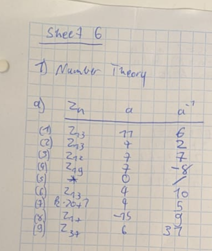
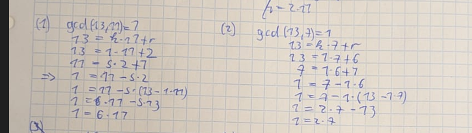
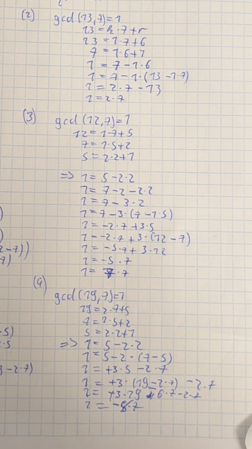
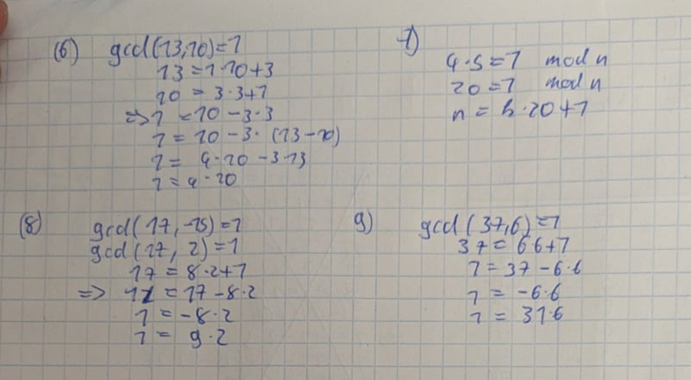
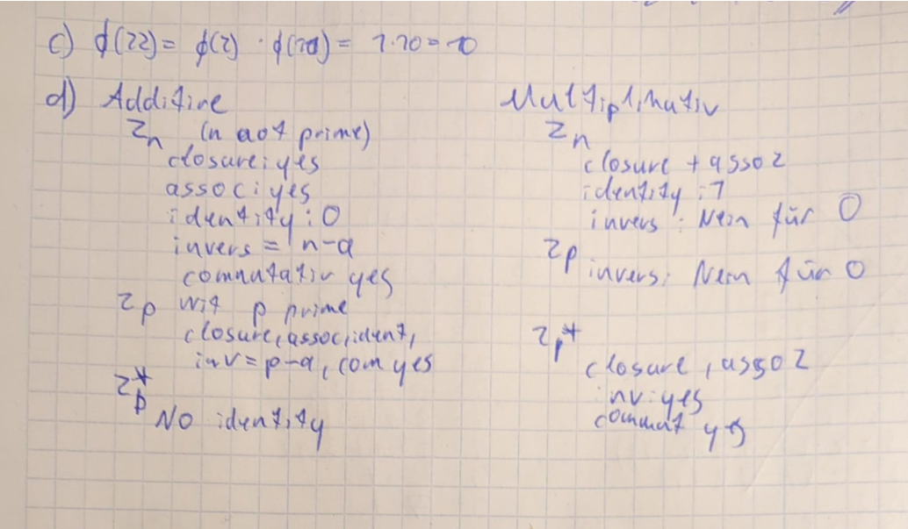
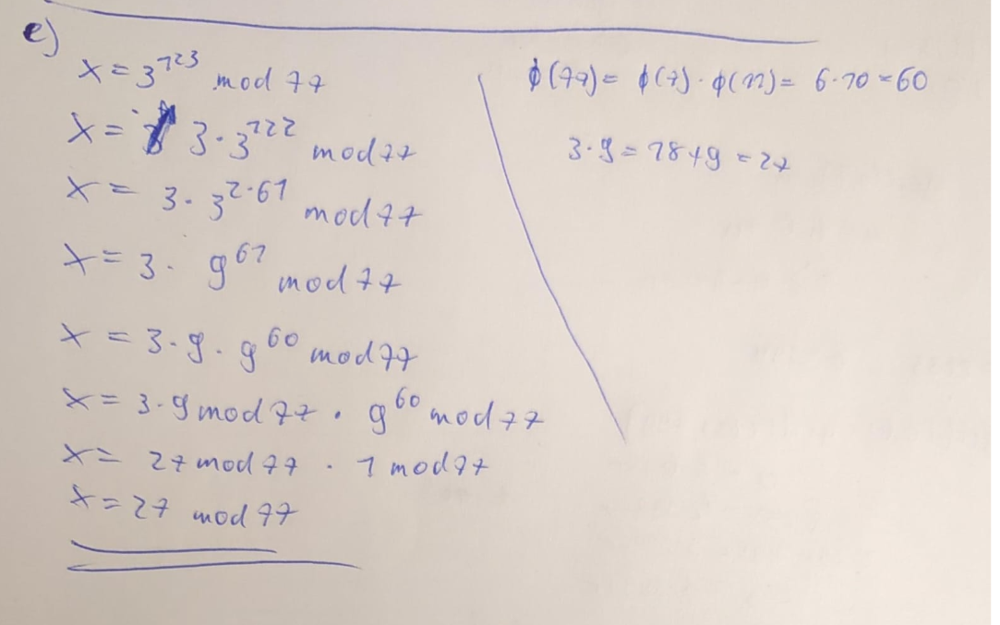
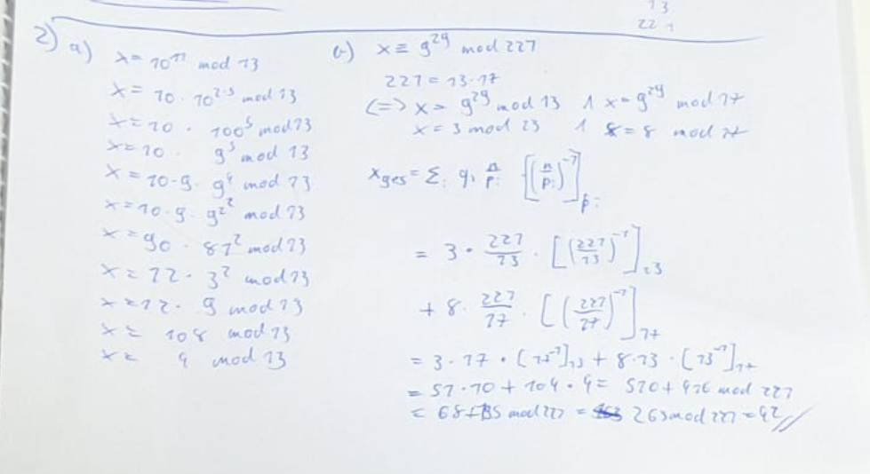
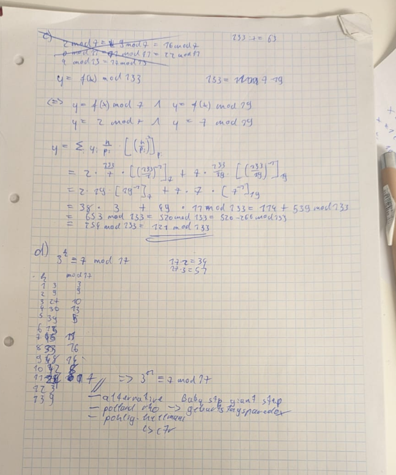

## 1 Number theory

b) 
$\phi(143)= \phi(11) * \phi(13) = 10*12 = 120 $

Closure: $a \circ b \in G$    
Associativity: $(a \circ b) \circ c = a \circ (b \circ c)$    
Identity Element: $e \circ a = a \circ e = a$  
Inverse Element: $a \circ a^{-1} = e$  
Commutativity: $a \circ b = b \circ a$ (This makes it "Abelian")
  

## 2 Algorithms

